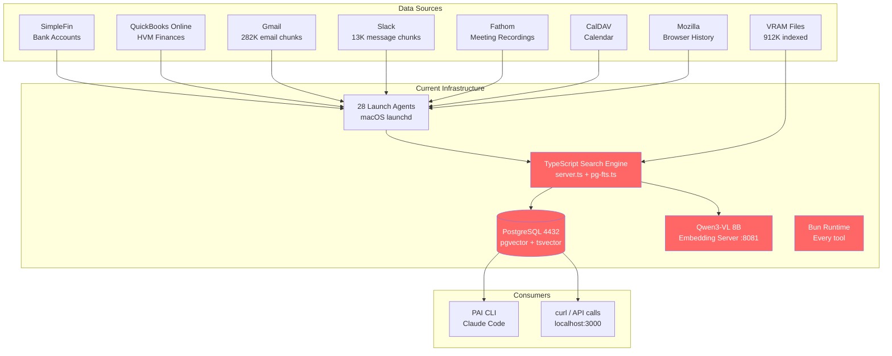
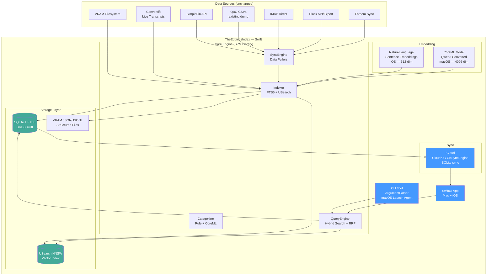
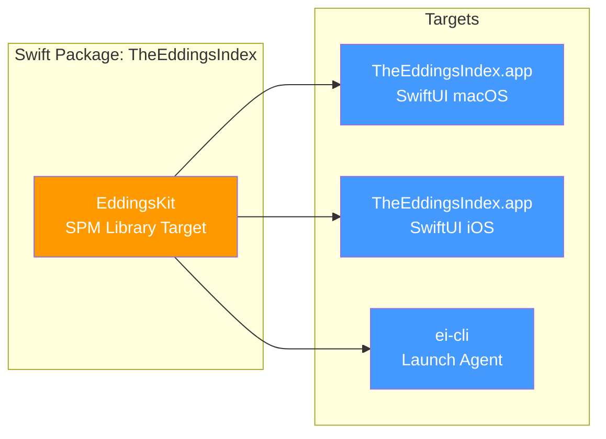
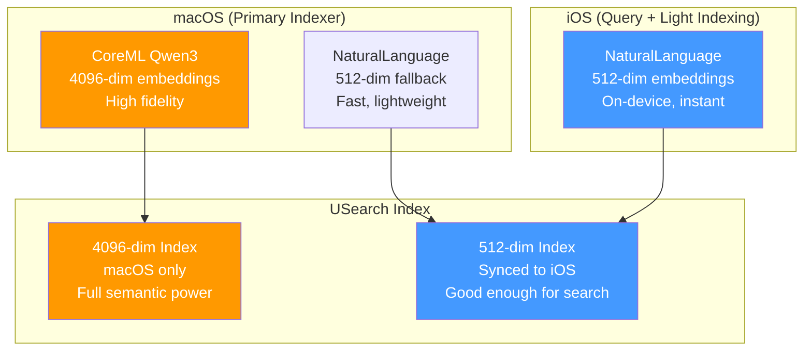
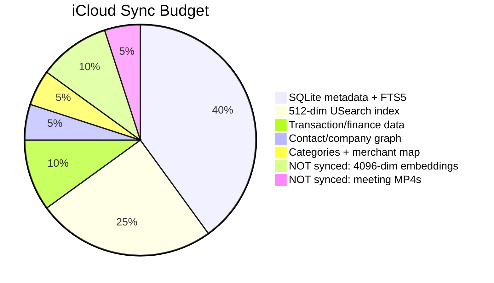
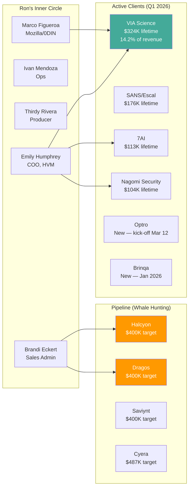
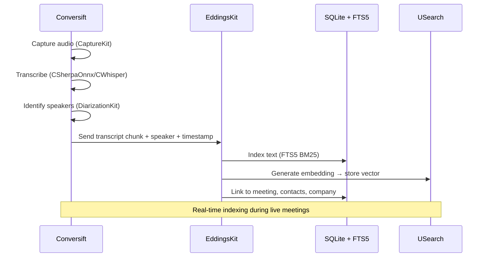
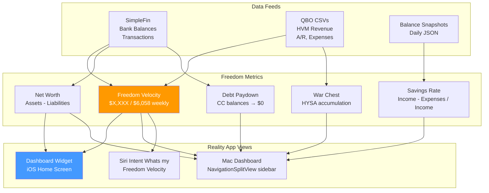
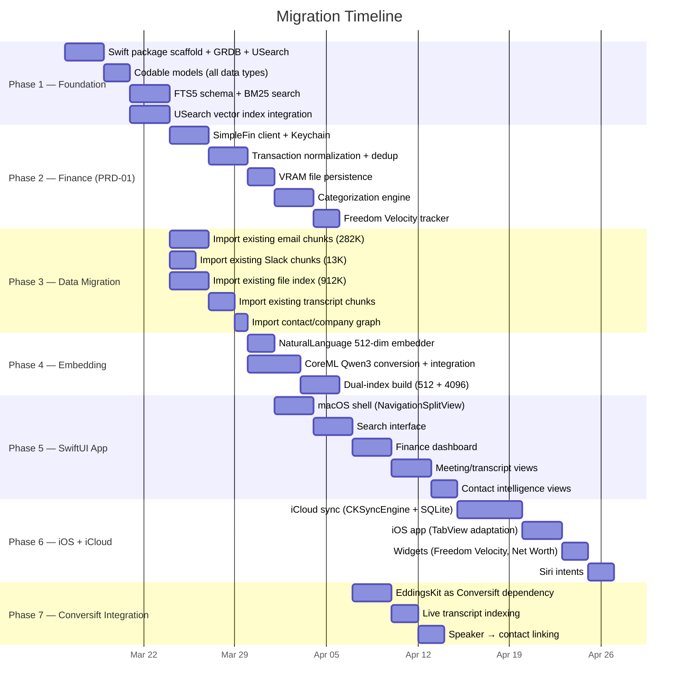

# TheEddingsIndex — A Personal Intelligence Platform

## From VRAM Search to TheEddingsIndex: Ron's Next-Gen Data OS

**Date:** 2026-03-15
**Author:** PAI
**For:** Ron Eddings — Creator, Entrepreneur, Technologist

---

## The Thesis

You've built 30+ tools on VRAM. You've indexed 382K embeddings across 912K files. You run 28 launch agents pulling from email, Slack, Fathom, QBO, CalDAV, and Mozilla. You built Conversift with 13 Swift modules, CoreML whisper, and real-time speaker diarization. You've been reverse-engineering Copilot Money, studying Apple's frameworks, and standardizing on Swift.

Every one of these systems solves a piece of the same problem: **Ron Eddings needs to search his reality.**

Not the internet. Not a database. His reality — 665GB of meeting recordings, 8GB of communications, 94 paying customers, $2.29M in lifetime revenue, 212 meetings in Q1 2026, a Freedom Acceleration Plan targeting $6,058/week, a 3-year-old and a 1-year-old at home, and a W-2 exit timeline measured in months.

The VRAM Search Engine was the proof of concept. TheEddingsIndex is the product.

---

## What Exists Today



**What's red = what gets replaced.** PostgreSQL, Bun, the TypeScript server, and the external embedding model — all collapse into a single Swift binary running on-device.

---

## What Gets Built



---

## The Name

**TheEddingsIndex** — because it searches Ron's actual reality, not the internet's version of it.

- Every meeting he's been in
- Every email he's sent or received
- Every Slack message from the HVM team
- Every dollar in and out of personal and business accounts
- Every podcast episode produced
- Every client relationship, scored and tracked
- Every goal, measured against reality
- Every recording Conversift captures in real time

This isn't a search engine. It's a **personal intelligence platform** that happens to be searchable.

---

## Architecture: Three Binaries, One Codebase



| Target | Platform | Purpose |
|--------|----------|---------|
| `EddingsKit` | macOS + iOS | Shared library — models, search, sync, indexing, categorization |
| `ei-cli` | macOS only | Headless sync daemon. Replaces all 28 launch agents with one binary. Runs twice daily. Pulls SimpleFin, reads QBO CSVs, syncs IMAP, indexes VRAM files. |
| `TheEddingsIndex.app` (macOS) | macOS 15+ | Full desktop app. NavigationSplitView. 4096-dim Qwen3 embeddings via CoreML. Deep Conversift integration. Full VRAM filesystem access. |
| `TheEddingsIndex.app` (iOS) | iOS 18+ | Mobile companion. 512-dim NaturalLanguage embeddings. iCloud-synced SQLite. Search your reality from anywhere. 2TB iPhone storage handles it. |

---

## Storage: SQLite + USearch + iCloud

### Why This Replaces PostgreSQL

| Capability | PostgreSQL (current) | SQLite + FTS5 + USearch |
|------------|---------------------|------------------------|
| Full-text search | tsvector (no TF/IDF ranking) | FTS5 BM25 (proper relevance scoring) |
| Semantic search | pgvector HNSW | USearch HNSW (10-100x faster) |
| Hybrid ranking | Custom RRF in TypeScript | Custom RRF in Swift (same algorithm, native speed) |
| Cross-device sync | None (localhost only) | iCloud via CKSyncEngine |
| Mobile access | None | Full iOS app |
| Dependencies | PostgreSQL server + pgvector extension + TypeScript + Bun | Zero — SQLite ships with OS, USearch is embedded |
| Deployment | localhost:4432 (always running) | Single `.sqlite` file + `.usearch` index |
| Backup | pg_dump | Copy two files |

### Dual Embedding Strategy



**macOS** generates two embeddings per chunk:
1. **4096-dim** (CoreML Qwen3) — stays on Mac, used for deep semantic search
2. **512-dim** (NaturalLanguage) — syncs to iOS via iCloud, used for mobile search

**iOS** only generates 512-dim embeddings for any content created on-device (e.g., quick notes, voice memos). This keeps the iPhone fast while still enabling semantic search.

### What Syncs vs. What Stays



| Data | Syncs to iCloud | Stays on Mac |
|------|:---------------:|:------------:|
| SQLite database (metadata, FTS) | Yes | Yes |
| 512-dim USearch index | Yes | Yes |
| 4096-dim USearch index | No | Yes |
| Meeting MP4 recordings (665GB) | No | Yes |
| Email JSON archives (8GB) | No | Yes |
| Transaction JSON (VRAM files) | Yes | Yes |
| Contact/company graph | Yes | Yes |
| Transcript text (no video) | Yes | Yes |
| Categorization rules + merchant map | Yes | Yes |
| Conversift live capture data | No | Yes |
| Balance snapshots + summaries | Yes | Yes |

**Ron's 2TB iPhone** handles the synced subset easily. The heavy stuff (665GB meetings, 8GB email archives) stays on VRAM. But the *searchable index* of all of it lives on both devices.

---

## Data Domains: What Gets Indexed

### Ron's Reality in Numbers

| Domain | Volume | Source | Current Status |
|--------|--------|--------|----------------|
| **Meetings** | 212 in Q1 2026 (97 Jan + 65 Feb + 50 Mar) | Fathom recordings + transcripts | 665GB on VRAM, transcripts indexed |
| **Emails** | 4,784 in Q1 2026 (1,609 + 1,748 + 1,427) | Gmail via IMAP | 282K chunks indexed |
| **Slack** | 13K+ message chunks | HVM Slack workspace (2018-present) | Indexed |
| **Files** | 912K indexed (760K .md, 145K .json) | VRAM filesystem | Indexed |
| **Finance (Personal)** | 8+ institutions | SimpleFin Bridge API | Not yet — PRD-01 |
| **Finance (HVM)** | $2.29M lifetime, 94 customers | QBO dump (12h cycle) | CSVs on VRAM |
| **Contacts** | 374 unique email senders in Jan alone | Email + Slack + meetings | Partially indexed |
| **Conversift** | Real-time audio + transcription | Live system capture | On Mac only |
| **Calendar** | Daily schedule | CalDAV sync | Script exists |
| **Browser** | Browsing history | Mozilla sync | Script exists |

### The Contact/Company Intelligence Graph



The TheEddingsIndex doesn't just store contacts — it **knows** them. Every email exchange, every meeting transcript, every Slack DM, every invoice. When Ron asks "What's my relationship with Halcyon?", the answer isn't a CRM card — it's every touchpoint across every channel, ranked by recency and depth.

---

## Conversift Integration

Conversift is already a 13-module Swift package with CoreML, real-time audio capture, speaker diarization, and whisper transcription. The TheEddingsIndex doesn't replace Conversift — it **consumes** it.



**Shared modules between Conversift and Reality:**
- `DiarizationKit` — speaker identification
- `AIKit` — CoreML inference providers
- `DataKit` — data models and persistence
- `Shared` — common utilities

Both are Swift packages. Both target macOS. The integration is a local SPM dependency — no network, no API, no serialization overhead.

---

## Freedom Acceleration Dashboard

Goal #7 is the Family Money Dashboard. The TheEddingsIndex makes it native.



**The one number that matters:** Weekly non-W2 take-home vs $6,058 target. Visible on the iOS home screen widget. Updated twice daily. No opening an app. No checking a spreadsheet. Just glance at your phone.

---

## Swift Package Structure

```
TheEddingsIndex/
├── Package.swift
├── Sources/
│   ├── EddingsKit/                    # Shared library (macOS + iOS)
│   │   ├── Models/
│   │   │   ├── Transaction.swift
│   │   │   ├── Contact.swift
│   │   │   ├── Company.swift
│   │   │   ├── Meeting.swift
│   │   │   ├── EmailMessage.swift
│   │   │   ├── SlackMessage.swift
│   │   │   ├── BalanceSnapshot.swift
│   │   │   └── SearchResult.swift
│   │   ├── Storage/
│   │   │   ├── DatabaseManager.swift  # GRDB.swift + FTS5
│   │   │   ├── VectorIndex.swift      # USearch HNSW wrapper
│   │   │   ├── SyncManager.swift      # CKSyncEngine iCloud
│   │   │   └── VRAMWriter.swift       # JSON/JSONL file persistence
│   │   ├── Search/
│   │   │   ├── QueryEngine.swift      # Unified search orchestrator
│   │   │   ├── FTSSearch.swift        # SQLite FTS5 BM25
│   │   │   ├── SemanticSearch.swift   # USearch similarity
│   │   │   └── HybridRanker.swift     # RRF fusion (same algorithm)
│   │   ├── Embedding/
│   │   │   ├── EmbeddingProvider.swift # Protocol
│   │   │   ├── NLEmbedder.swift       # NaturalLanguage 512-dim (iOS + macOS)
│   │   │   └── CoreMLEmbedder.swift   # Qwen3 4096-dim (macOS only)
│   │   ├── Sync/
│   │   │   ├── SimpleFinClient.swift  # Bank data pull
│   │   │   ├── QBOReader.swift        # QBO CSV parser
│   │   │   ├── IMAPClient.swift       # Email sync
│   │   │   ├── SlackClient.swift      # Slack data pull
│   │   │   ├── FathomClient.swift     # Meeting sync
│   │   │   └── CalDAVClient.swift     # Calendar sync
│   │   ├── Categorize/
│   │   │   ├── Categorizer.swift      # Transaction categorization
│   │   │   ├── MerchantMap.swift      # Merchant → category
│   │   │   └── ContactExtractor.swift # Auto-populate contact graph
│   │   ├── Intelligence/
│   │   │   ├── FreedomTracker.swift   # $6,058/week velocity
│   │   │   ├── AnomalyDetector.swift  # Unusual transactions
│   │   │   ├── RelationshipScorer.swift # Contact interaction depth
│   │   │   └── ActivityDigest.swift   # Daily/weekly summaries
│   │   └── Auth/
│   │       └── KeychainManager.swift  # SecItem credential storage
│   │
│   ├── EddingsCLI/                    # macOS CLI (launch agent)
│   │   ├── EddingsCLI.swift           # @main ArgumentParser
│   │   └── Commands/
│   │       ├── SyncCommand.swift      # Pull all sources
│   │       ├── IndexCommand.swift     # Rebuild search index
│   │       ├── SearchCommand.swift    # CLI search
│   │       └── StatusCommand.swift    # Health check
│   │
│   ├── EddingsApp/                    # SwiftUI (macOS + iOS)
│   │   ├── EddingsApp.swift           # @main App entry
│   │   ├── Navigation/
│   │   │   ├── SidebarView.swift      # macOS NavigationSplitView
│   │   │   └── TabBarView.swift       # iOS TabView
│   │   ├── Search/
│   │   │   ├── SearchView.swift       # Unified search interface
│   │   │   └── SearchResultRow.swift  # Result rendering
│   │   ├── Finance/
│   │   │   ├── DashboardView.swift    # Freedom Velocity + net worth
│   │   │   ├── TransactionList.swift  # Categorized transactions
│   │   │   └── DebtTrackerView.swift  # Paydown trajectory
│   │   ├── Meetings/
│   │   │   ├── MeetingListView.swift  # Meeting history
│   │   │   └── TranscriptView.swift   # Searchable transcript
│   │   ├── Contacts/
│   │   │   ├── ContactListView.swift  # Relationship graph
│   │   │   └── ContactDetailView.swift # Full interaction history
│   │   └── Settings/
│   │       └── SettingsView.swift     # Sync config, accounts
│   │
│   └── EddingsWidgets/               # WidgetKit
│       ├── FreedomVelocityWidget.swift
│       ├── NetWorthWidget.swift
│       └── UpcomingMeetingsWidget.swift
│
├── Tests/
│   └── EddingsKitTests/
├── Models/                            # CoreML models
│   └── Qwen3Embedding.mlmodel        # Converted from ONNX
└── com.vram.eddings-index.plist             # Launch agent
```

### Dependencies

```swift
dependencies: [
    .package(url: "https://github.com/apple/swift-argument-parser", from: "1.5.0"),
    .package(url: "https://github.com/groue/GRDB.swift", from: "7.0.0"),
    .package(url: "https://github.com/unum-cloud/usearch", from: "2.0.0"),
]
```

Three dependencies. Everything else is Apple SDK:
- **Foundation** — URLSession, FileManager, JSONCoder, Data, Keychain
- **NaturalLanguage** — On-device sentence embeddings
- **CoreML** — Qwen3 embedding model (macOS)
- **CloudKit** — CKSyncEngine for iCloud sync
- **WidgetKit** — Home screen widgets
- **AppIntents** — Siri integration
- **os** — Logger structured logging

---

## Migration Path: VRAM Search Engine → TheEddingsIndex



---

## What Dies

When the TheEddingsIndex is live:

| System | Status | Reason |
|--------|--------|--------|
| PostgreSQL localhost:4432 | **Killed** | Replaced by SQLite + GRDB |
| pgvector extension | **Killed** | Replaced by USearch |
| TypeScript search_engine (`server.ts`) | **Killed** | Replaced by EddingsKit native queries |
| Qwen3-VL embedding server (:8081) | **Replaced** | CoreML model runs in-process |
| Bun runtime (for search tools) | **Killed** | Swift native |
| Actual Budget (Railway) | **Killed** | SimpleFin direct (PRD-01) |
| 28 individual launch agents | **Consolidated** | One `ei-cli sync` binary |
| `curl localhost:3000/search` pattern | **Replaced** | PAI calls EddingsKit directly |

**What survives:**
- VRAM filesystem (the source of truth)
- QBO dump agent (still pulls CSVs — consumed by EddingsKit)
- Conversift (enhanced, not replaced — gains EddingsKit as a dependency)
- PAI (gains native Swift search instead of HTTP API calls)

---

## Why This Matters for Ron

### As a Creator
Every podcast episode, every meeting, every conversation — searchable, indexed, connected. "What did Nate Burke say about AI agents in our January call?" is a 200ms local query, not a 20-minute dig through Fathom.

### As an Entrepreneur
The Freedom Acceleration Plan gets a native dashboard. $6,058/week target visible on the iPhone home screen. Debt paydown trajectory. War chest growth. Pipeline health. All from SimpleFin + QBO data flowing through the same engine.

### As a Technologist
This is the app Ron would build even if no one else ever used it. It's the culmination of 30+ tools, condensed into one Swift codebase. Three dependencies. Zero servers. Runs on Apple Silicon. Syncs via iCloud. Ships as a signed `.app` with the Hacker Valley Developer ID cert.

### As a Father
Check your finances from the couch while the kids are playing. Search for that meeting note without opening a laptop. The whole point of Freedom Acceleration is time with family — the TheEddingsIndex removes friction from the systems that make that possible.

---

## The Vision: One App to Search Your Entire Life

```
┌─────────────────────────────────────────────────────┐
│                                                       │
│   🔍  "What happened with Optro last week?"          │
│                                                       │
│   ──────────────────────────────────────────────      │
│                                                       │
│   Meeting: Optro <> Hacker Valley kick-off call       │
│   Mar 12, 2026 • 5 participants                       │
│   "...discussed content strategy for Q2..."           │
│                                                       │
│   Email: Re: Optro Partnership Agreement              │
│   From: partnerships@optro.ai • Mar 11                │
│   "Attached is the signed SOW for..."                 │
│                                                       │
│   Slack: #hvm-clients                                 │
│   Emily: "Optro kick-off went great, they want..."    │
│                                                       │
│   Finance: Invoice #1847 — Optro Security             │
│   $13,500 • Due: Apr 11, 2026 • Net 30                │
│                                                       │
│   Contact: Sarah Chen, VP Marketing @ Optro           │
│   12 emails • 3 meetings • Last seen: Mar 12          │
│                                                       │
└─────────────────────────────────────────────────────┘
```

One query. Five data sources. Ranked by relevance. Running on your phone.

That's the TheEddingsIndex.
